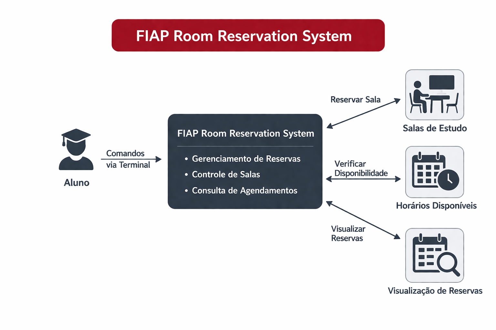
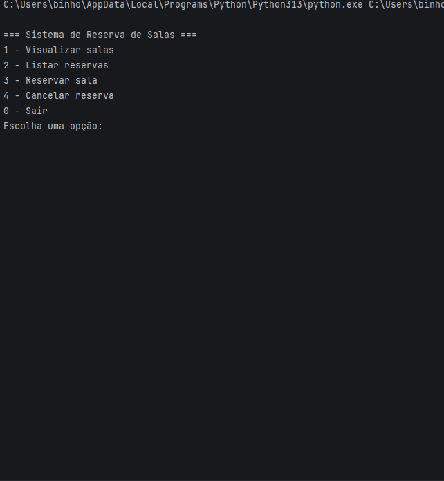

# 🏫 Sistema de Reserva de Salas FIAP



---

## 📌 Descrição do Problema

Dificuldade de encontrar salas disponíveis para estudo.

---

## 💡 Solução Proposta

Sistema em Python que permite reservar salas de estudo de forma simples e eficiente.

---

## 🛠️ Tecnologias Utilizadas

* 🐍 Python
* 📄 JSON

---

## ▶️ Como Executar

```bash
python src/sistema_reserva_salas.py
```

---

## 📋 Funcionalidades

* Ver salas
* Reservar
* Cancelar
* Listar reservas

---

## 🎥 Demonstração



---

## 👥 Integrantes

* 👨‍💻 Fabio Henrique Santos Farias
* 👨‍💻 Carlos Augusto da Cruz Possi
* 👨‍💻 João Pedro Bernardo Santos da Silva

---

## 🔗 Links

🧠 **Miro (Documentação e Diagramas)**
https://miro.com/app/board/uXjVGwGD7H4=/?share_link_id=899993910065

💻 **Colab**
https://colab.research.google.com/drive/1IDkm92TqKFn3YvFlW22JfamUdzKsnMz9?usp=sharing
